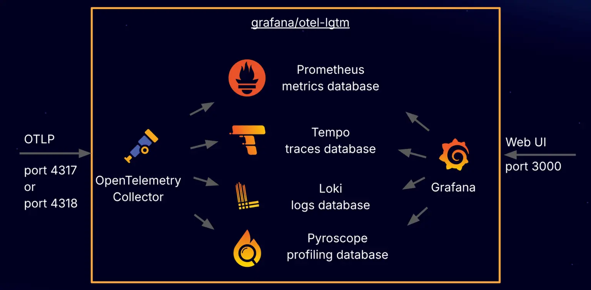

# Observation

## Microservices Patterns

[Microservices Patterns](https://microservices.io/patterns/index.html)

11.3 Designing observable services

- Health check API
- Log aggregation
- Distributed tracing
- Exception tracking
- Application metrics
- Audit loggers

## The Twelve-Factor App

XI. Logs

"Instead, each running process writes its event stream, unbuffered, to stdout."

Fejlesztői környezetben könnyen használható
Egyéb környezetben nem az app. felelősségi köre

## Observability

* Metrics
* Logs
* Traces

## Klasszikus megoldások

Saját protokoll, saját formátum

### Metrics

Két megközelítés: push, scrape/pull

Legelterjedtebb: Prometheus (scrape), CNCF projekt

Grafana Mimir:

 - Prometheus skálázása problémás
 - Prometheus scrape-el, továbbít (remote write) a Mimirnek
 - Grafana hosszú távú query-ket a Mimiren futtat

Thanos:

 - Hasonló cél, csak más megközelítés
 - Sok kisebb komponens
 - Prometheus scrape-el
 - Nagyon sok kis komponenssel egészíti ki a Prometheus-t, hogy elosztott működésre legyen képes


### Logs

ELK, később EFK stack
Logstash (Java), Fluentd (Ruby)

Egyedi formátumok, stacktrace miatt probléma a sortörésekkel

2021 elején az Elastic (a cég) úgy döntött, hogy licencet vált: az Elasticsearch és Kibana újabb verziói már nem Apache 2.0 alatt jelentek meg, hanem SSPL + Elastic License alatt.

* Az AWS fogta az Elasticsearch utolsó Apache 2.0-s kódbázisát (ez a 7.10.2 verzió környéke),
* és ebből készített egy forkot, amit OpenSearch néven indított el.
* A vizuális felületből (Kibana) is fork lett: OpenSearch Dashboards.

Grafana Loki

### Trace

Trace, span

Jaeger, Zipkin

- B3 header - régebbi
- W3C Trace Context - újabb szabvány

Később a trace és span id kerüljön be a logba, így összeköthető

Grafana Tempo

### Vizualizáció

Grafana

## Kubernetes

Prometheus kvázi standard eszköz monitorozásra:

* Dynamic service discovery (Kubernetes API-n keresztül megkapja metrikákat)
* Label-alapú monitorozás (Pod és container szintű metrikák)
* Pod és container szintű metrikák

* Alap Kubernetes autoscaling (HPA CPU/mem) → Metrics Server
* Custom autoscaling (pl. request/sec, queue size) → gyakran Prometheus (adapterrel vagy KEDA-val)

Log:

- Sidecar log collector (podon belül)
  - Minden podban extra konténer :(
- DaemonSet log collector (node-on)
  - DaemonSet - node-onként egy legyen belőle
  - Feladata:
    - Olvassák a konténerek logjait a node fájlrendszeréről
    - Feldolgozzák (parse, JSON, label, filter, enrich)
    - Továbbküldjék a log backend felé
  - Pl. Fluent Bit

12-factor kompatibilis

## OpenTelemetry

OpenTelemetry, also known as OTel, is a vendor-neutral open source Observability framework for instrumenting, generating, collecting, and exporting telemetry data such as traces, metrics, and logs.

* wire protocol (OTLP), API, libraries/SDK, agents, collector
* 12+ languages including Java, Kotlin, Python, Go, JavaScript, .NET, Ruby, PHP, Rust, C++, Swift, and Erlang
* No backend
* CNCF incubating project

Signals:

* Traces (span, event)
* Metrics
* Logs
* Baggage

https://opentelemetry.io/docs/specs/otel/profiles/
  app level profiling
  system level profiling

Instrumentation:

* Code based, SDK
* Zero-code auto instrumentation with agent


Semantic Conventions

https://opentelemetry.io/docs/specs/semconv/

https://opentelemetry.io/docs/specs/semconv/runtime/jvm-metrics/


### Collector

Disztribúciói vannak:

https://opentelemetry.io/docs/collector/distributions/

https://github.com/open-telemetry/opentelemetry-collector-releases/blob/main/distributions/otelcol-contrib/README.md


* Receivers: collect telemetry from one or more sources
* Processor: Transform, filter, and enrich telemetry data
* Exporters Send telemetry data to observability backends
* Connectors Connect two pipelines, acting as both exporter and receiver
* Extensions additional capabilities like health checks

https://opentelemetry.io/docs/collector/configuration/

#### Receiver

https://opentelemetry.io/docs/collector/components/receiver/

https://github.com/open-telemetry/opentelemetry-collector-contrib/tree/main/receiver

https://github.com/open-telemetry/opentelemetry-collector/tree/main/receiver/otlpreceiver

4317 gRPC, 4318 http

#### Processors

Batch Processor

* Összevárja az adatokat, jobban tömöríthető, kevesebb kapcsolatfelvétel

#### Exporters

https://opentelemetry.io/docs/collector/components/exporter/

otlpexporter, otlphttpexporter, az egyetlen stable

#### Connector

Pipeline-okat köt össze, vagy ugyanolyan típusúakat, vagy nagyon gyakori a
bármilyen típusból metrikát gyártó, pl. countconnector v. slowsqlconnector

https://github.com/open-telemetry/opentelemetry-collector-contrib/tree/main/connector/countconnector

https://github.com/open-telemetry/opentelemetry-collector-contrib/tree/main/connector/slowsqlconnector

#### Telemetrygen

https://www.controltheory.com/resources/how-to-use-telemetrygen-to-feed-telemetry-to-the-otel-collector/

#### Mindig érdemes használni?

* Valójában egy observability proxy
  * Protokoll fordítás
  * Platformfüggetlenség, cserélhető backend
  * Processing
    * Sampling: csak bizonyos feltételeknek megfelelő signalokat enged tovább
      * Pl. tail - bevárja az egész trace-t, és dönt
      * Attribútumok filterelése, transzformációja, kibővítése
      * Batch - performancia
      * Retry, backoff, queue/buffer - lassú, megbízhatatlan backend
      * Multi-tenant routing: node-onként collector

#### OLTP-t natívan támogató backendek

* Prometheus: scrape, később OTLP receiver
* OpenSearch natívan támogatja az OTLP-t
* Grafana Loki 3.x‑től van natív OTLP log ingest
* Jaeger natívan támogatja az OTLP-t
* Tempo 1.5+ verzióktól közvetlenül képes OTLP trace-eket fogadni

Mindegyik csak a neki megfelelő típust, metrics, trace, log

## docker-otel-lgtm

https://github.com/grafana/docker-otel-lgtm

* OpenTelemetry backend in a Docker image
* Development, demo, and testing environments

Components:

* OpenTelemetry Collector: Receives and forwards telemetry signals to observability backends.
* Prometheus: Stores and queries your application’s metrics (e.g., request rates, error counts, system health).
* Loki: Stores and queries your application’s logs.
* Tempo: Stores and queries traces.
* Pyroscope: Stores and queries profiles, helping you understand which parts of your code are consuming the most resources (like CPU time or memory).
* Grafana: Visualizes all this data in dashboards.



(All implemented in Go)

```shell
docker run \
	--name lgtm \
	-p 3000:3000 \
	-p 4040:4040 \
	-p 4317:4317 \
	-p 4318:4318 \
	-p 9090:9090 \
	-d \
	grafana/otel-lgtm:latest
```

* Log

Open ports:

- 4317: OpenTelemetry GRPC endpoint
- 4318: OpenTelemetry HTTP endpoint
- 3000: Grafana (http://localhost:3000). User: admin, password: admin
- 4040: Pyroscope endpoint
- 9090: Prometheus endpoint

Data sources

Run queries in Grafana Explore

- Prometheus: PromQL
- Tempo: TraceQL
- Loki: LogQL

## Spring Boot

Micrometer

Micrometer provides a facade for the most popular observability systems, allowing you to instrument your JVM-based application code without vendor lock-in. Think SLF4J, but for observability.

MeterRegistry

Actuator - Prometheus exporter

Micrometer Tracing (Trace, Span) 

OpenZipkin Brave (`micrometer-tracing-bridge-brave`)
OpenTelemetry (`micrometer-tracing-bridge-otel`)

Log:

SLF4J -> Logback (Appender)

Micrometer Observation

https://docs.micrometer.io/micrometer/reference/observation.html

"Instrument code once, and get multiple benefits out of it."

ObservationRegistry

Actuator: Health check

OpenTelemetry:

* Java agent
* OpenTelemetry Spring Boot starter https://opentelemetry.io/docs/zero-code/java/spring-boot-starter/
* Spring Boot 4 OpenTelemetry Starter

### Instrumentation

```shell
cd target
curl -L -O https://github.com/open-telemetry/opentelemetry-java-instrumentation/releases/latest/download/opentelemetry-javaagent.jar
```

```shell
set JAVA_TOOL_OPTIONS="-javaagent:opentelemetry-javaagent.jar" 
set OTEL_TRACES_EXPORTER=logging
set OTEL_METRICS_EXPORTER=logging
set OTEL_LOGS_EXPORTER=logging
set OTEL_METRIC_EXPORT_INTERVAL=15000
```

```shell
java -jar employees-backend-0.0.1-SNAPSHOT.jar
```

https://opentelemetry.io/docs/zero-code/java/agent/supported-libraries/

https://github.com/open-telemetry/opentelemetry-java-instrumentation/blob/main/instrumentation/spring/spring-data/spring-data-1.8/javaagent/src/main/java/io/opentelemetry/javaagent/instrumentation/spring/data/v1_8/SpringDataInstrumentationModule.java


## Starter

https://spring.io/blog/2025/11/18/opentelemetry-with-spring-boot

https://foojay.io/today/spring-boot-4-opentelemetry-explained/

https://www.danvega.dev/blog/opentelemetry-spring-boot

```xml
<dependency>
    <groupId>org.springframework.boot</groupId>
    <artifactId>spring-boot-starter-opentelemetry</artifactId>
</dependency>
```

Transitive dependencies

```yaml
management:
  tracing:
    sampling:
      probability: 1.0
  otlp:
    metrics:
      export:
        url: http://localhost:4318/v1/metrics
  opentelemetry:
    tracing:
      export:
        otlp:
          endpoint: http://localhost:4318/v1/traces
```

```xml
<dependency>
  <groupId>org.springframework.boot</groupId>
  <artifactId>spring-boot-starter-restclient</artifactId>
</dependency>
```

Context propagation

`<version>-<trace-id>-<parent-id>-<trace-flags>`

### Naplózás

`pom.xml`

```xml
<dependency>
  <groupId>io.opentelemetry.instrumentation</groupId>
  <artifactId>opentelemetry-logback-appender-1.0</artifactId>
  <version>2.24.0-alpha</version>
</dependency>
```

```yaml
management:
  opentelemetry:
    logging:
      export:
        otlp:
          endpoint: http://localhost:4318/v1/logs
```

`src/main/resources/logback-spring.xml`

```xml
<?xml version="1.0" encoding="UTF-8"?>
<configuration>
    <include resource="org/springframework/boot/logging/logback/base.xml"/>

    <appender name="OTEL" class="io.opentelemetry.instrumentation.logback.appender.v1_0.OpenTelemetryAppender">
    </appender>

    <root level="INFO">
        <appender-ref ref="CONSOLE"/>
        <appender-ref ref="OTEL"/>
    </root>
</configuration>
```

```java
import io.opentelemetry.api.OpenTelemetry;
import io.opentelemetry.instrumentation.logback.appender.v1_0.OpenTelemetryAppender;
import org.springframework.beans.factory.InitializingBean;
import org.springframework.stereotype.Component;

@Component
public class InstallOpenTelemetryAppender implements InitializingBean {
    private final OpenTelemetry openTelemetry;
    public InstallOpenTelemetryAppender(OpenTelemetry openTelemetry) {
        this.openTelemetry = openTelemetry;
    }
    @Override
    public void afterPropertiesSet() throws Exception {
        OpenTelemetryAppender.install(openTelemetry);
    }
}
```

### Saját metrika

`@Observed` - preferált

Micrometer Observation Annotations support
To enable scanning of observability annotations like `@Observed`, `@Timed`, `@Counted`, `@MeterTag` and `@NewSpan`, set the `management.observations.annotations.enabled` property to true. A dependency on `org.aspectj:aspectjweaver`, which is part of `spring-boot-starter-aspectj` (sic!), is also required. This feature is supported by Micrometer directly. Please refer to the Micrometer, Micrometer Observation and Micrometer Tracing reference docs.

```xml
<dependency>
  <groupId>org.springframework.boot</groupId>
  <artifactId>spring-boot-starter-aop</artifactId>
  <version>3.5.10</version>
</dependency>
```

```yaml
management:
  observations:
    annotations:
      enabled: true
```

## 12 factor app vs. OTel log

## Exception tracking

* Trace
  * Event 
  * Probability!
* Log
  * Stacktrace
  * Exception handling best practice-ek
* Metrics
  * Számosság

Dedikált eszköz: Sentry

## Health check

* Liveness: Kubernetes újraindítja
* Readiness: nem kap kéréseket

## Resilience

```java
if (random.nextInt(3) == 0) {
    throw new RuntimeException("Simulated error");
}
```

`@EnableResilientMethods`

```java
@Retryable(maxRetries = 3, delay = 100, multiplier = 2, maxDelay = 1000)
@ConcurrencyLimit(3)
```


